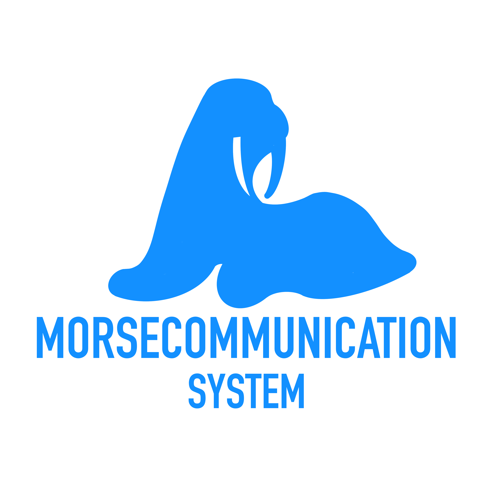

# MORSECommunication System

# Table of Contents 📖

1. [About](#About)
2. [Technologies](#Technologies)
3. [Project structure](#Project_structure)
4. [Getting started](#Getting_started)
5. [Usage](#Usage)
6. [Administration](#Admnistration)
7. [Contacts](#Contacts)

# About 📄

MORSE Communication System is a system designed to encode and decode messages using Morse code. The system allows the conversion of text into encoded Morse code messages and vice versa—decoding Morse code back into text. The encoded messages are stored in an XML file, ensuring easy access and data transparency. This system can be used for educational purposes.

# Technologies 💻

- **XML/XSD:** XML files are used for message exchange, and XSD for schema validation.
- **React.js:** For building the user interface of the web application.

# Project structure 📂

<ol>
    <li>public - Contains static assets like images, fonts, etc.</li>
    <li>src - Main source code for the application
    <ol>
        <li>assets - Contains assets</li>
        <li>components - React components for the interface</li>
        <li>App.css - Cascading Style Sheet</li>
        <li>App.jsx - Main application component</li>
        <li>index.css - Entry point for React</li>
        <li>main.jsx</li>
    </ol>
  </li>
  <li>.gitattributes - Git attributes configuration</li>
  <li>.gitignore - Specifies files and folders to ignore in git</li>
  <li>README.md - Documentation with project overview and instructions</li>
  <li>index.html - Main HTML file for the application</li>
</ol>

# Getting started ▶️

## Prerequisites 📝

To use and interact with the MORSE Communication System, you'll need:

- **Web Browser**: The application is optimized for modern browsers. We tested website with latest version of:
  - **Google Chrome**
  - **Mozilla Firefox**
  - **Microsoft Edge**

## Development Environment Setup ⚙️

If you plan on contributing to the development or making modifications to the system, simply download and install Node.js (version 14 or higher) from [https://nodejs.org](https://nodejs.org).

We used **Visual Studio Code**, which offers excellent support for JavaScript and React projects.

## Installation 🖥️

The MORSE Communication System was designed with simplicity in mind:

- **No Software Installation Required**: To use the application, simply navigate to the project website using your web browser.
- **Local Development (Optional)**: For developers looking to run or modify the project locally, clone the repository and run the necessary commands (`npm install` followed by `npm start`) to launch a local server.

## Sanity Test ✅

The MORSE Communication System operates entirely on the client side.

- **No Server Dependencies**: All functionalities, from encoding/decoding Morse code to managing XML files, are handled directly in the user's browser for privacy.

# Usage 🚀

- **Encoding Messages**:

  - Enter the desired text in the text box
  - Download the XML file with the encoded message

- **Decoding Messages**:
  - Upload the XML to the site, and you will receive the decoded message

# Administration 🏢

The MORSE Communication System operates entirely on the client side, providing a lightweight and efficient experience. Application minimizes administrative overhead

# Contacts 👥

- **Wiktoria Bielecka:** Backend programmer (decoding), readme.md creator
- **Piotr Eliks:** Fullstack developer (encoding), repository manager
- **Maciej Kordek:** Backend programmer (decoding), tester
- **Miłosz Klim:** Backend programmer (encoding), scrum master

### Observations

- The biggest challenge we faced was validating the XML file, as the package manager blocked relevant libraries, considering them potential threats. This issue required considerable effort and creativity to resolve, delaying other aspects of the project.
- The implementation of algorithms for encoding and decoding Morse code was relatively straightforward, though we did not strictly adhere to a separation of teams responsible for encoding and decoding. Instead, our collaborative approach meant structuring the XML and XSD together before dividing tasks based on individual competencies.
- Each member of the team brought unique strengths and expertise, contributing across various project elements. While everyone contributed code, some focused more heavily on graphical aspects, others handled technical underpinnings, and another group took on documentation. Every role proved to be invaluable for achieving our goals.
- For user convenience, we chose to build a web-based application. A significant amount of time outside class hours was dedicated to refining the UI/UX, aiming to deliver a polished and user-friendly experience. This comprehensive approach, reminiscent of a "gamejam" style process, enabled us to move from concept to a fully functional product with deployment. It was a rewarding and enriching experience.
- The project provided valuable experience in team programming, working with data formats (XML), and creating simple applications with graphical interfaces.
